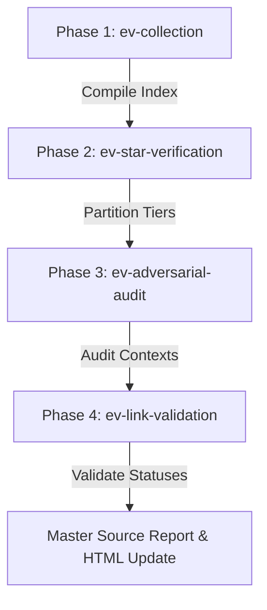

# Evidence Verification Pipeline (ev-pipeline)

Orchestrates the four evidence verification phases that take the raw data lake from "collected" to "audited and link-checked." Run this before ingesting any evidence into the canonical registry — it is a pre-flight step, not a post-flight one.

> **Scope:** This pipeline operates on the evidence data lake (`evidence/`) only. It does not touch `registry/nodes/` or `registry/named/`. Think of it as quality-gating the raw material before promotion.



---

## Why this order matters

Each phase produces output that the next phase consumes. Running them out of order corrupts the audit trail:

- Collection builds the index that star-verification partitions against.
- Star-verification assigns tier labels that adversarial reviewers use to prioritise their scan.
- Adversarial audit flags broken URLs that link-validation then formally checks.
- Link-validation closes the loop with live HTTP status codes, which feed the final report.

---

## Phase 1 — Evidence Collection (`ev-collection`)

Aggregates raw sources from `evidence/collectors/` and compiles the master `unified_evidence_lake.md` index. This is the foundation — nothing downstream runs correctly without an up-to-date index.

```
/ev-collection
```

---

## Phase 2 — Live Star Verification (`ev-star-verification`)

Queries the GitHub API for stargazer counts, cross-references them against `registry/named/` Markdown files, and writes tiered partition files under `evidence/`. Star counts determine Trust Magnitude scores, so stale counts produce inaccurate rankings.

```
/ev-star-verification
```

---

## Phase 3 — Adversarial Audit (`ev-adversarial-audit`)

Fans out parallel reviewer agents that scan the data lake for evaluative noise, `tree/` vs `blob/` URL errors, and proxy/source mismatches. Adversarial review catches systematic problems that a single-pass scan misses — two reviewers arguing about the same entry surfaces edge cases.

```
/ev-adversarial-audit
```

---

## Phase 4 — Link Validation (`ev-link-validation`)

Uses Firecrawl to scrape every unique URL in the data lake and confirm a 200 OK response. Dead links degrade TM scores and mislead registry consumers; this phase makes bad links visible before they get promoted.

```
/ev-link-validation
```

---

## Post-Run Outputs

After all four phases complete, save these artifacts:

1. **Validation report** — write to `evidence/collectors/verification/firecrawl_validation_report_YYYY_MM_DD.md`
2. **Master source report** — document the audit log, star updates, and adversarial findings in `evidence/source_report_YYYY_MM_DD.md`
3. **Visual dashboard** — update statistics and pipeline statuses in `evidence/verification_process.html`

Use today's date (`currentDate` from memory) for all `YYYY_MM_DD` placeholders.
