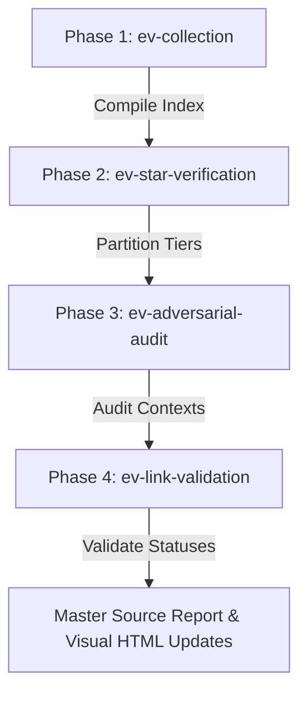

# Evidence Verification Pipeline

This is the canonical orchestrator for the Gaia evidence data lake. Both `/ev-pipeline` and `/evidence-verification-pipeline` invoke this same skill — they are aliases of each other with identical behavior.

> **When to run this:** Before any evidence gets imported into the registry. The pipeline validates the raw `evidence/` lake — it does not touch `registry/nodes/` or any canonical registry data. Running it late (after ingestion) is too late to catch URL errors or star-count drift.



---

## The Four Phases

Run these in order. Each phase produces output that the next phase consumes — skipping a phase produces incomplete or stale results downstream.

### Phase 1: Evidence Collection (`ev-collection`)

Aggregates raw evidence from `evidence/collectors/` and compiles the master index. This is the foundation — without it, Phases 2–4 operate on stale or missing data.

```bash
/ev-collection
```

### Phase 2: Live Star Verification (`ev-star-verification`)

Queries the GitHub API for current stargazer counts, validates them against `registry/named/` Markdown files, and partitions the data lake into tiers. Star counts drift constantly; this phase ensures the evidence lake reflects real signal, not cached values.

```bash
/ev-star-verification
```

### Phase 3: Adversarial Audit (`ev-adversarial-audit`)

Deploys parallel adversarial reviewer agents to scan the data lake for evaluative noise, URL format errors (e.g. `tree/` vs `blob/`), and proxy mismatches. Findings are appended to the daily source report. This phase exists because automated collectors make systematic mistakes — an adversarial pass catches patterns a single reviewer misses.

```bash
/ev-adversarial-audit
```

### Phase 4: Link Validation (`ev-link-validation`)

Performs a live Firecrawl scrape verifying uptime and HTTP 200 status for all unique URLs in the data lake. Dead links inflate Trust Magnitude scores with phantom evidence; this phase surfaces them before ingestion locks them in.

```bash
/ev-link-validation
```

---

## Post-Run Tasks

After all four phases complete, save the outputs so future pipeline runs and registry maintainers have an audit trail:

1. **Validation report:** Write to `evidence/collectors/verification/firecrawl_validation_report_YYYY_MM_DD.md`.
2. **Master source report:** Write audit log, star updates, and adversarial findings to `evidence/source_report_YYYY_MM_DD.md`.
3. **Visual dashboard:** Update statistics and pipeline statuses in `evidence/verification_process.html`.

## Ingestion Handoff

For L4-approved intake rows, successful Phase 4 is the boundary between the
raw evidence lake and canonical registry mutation. Create a reviewed evidence
manifest from only live, correctly scoped rows, then hand it to
`/gaia-ingest-batch`. That wrapper uses `/gaia-ingest` for every CLI-only
`gaia dev evidence` write, appraises TM, and presents calibration proposals.
Do not import evidence by hand or treat requested intake stars as evidence.
