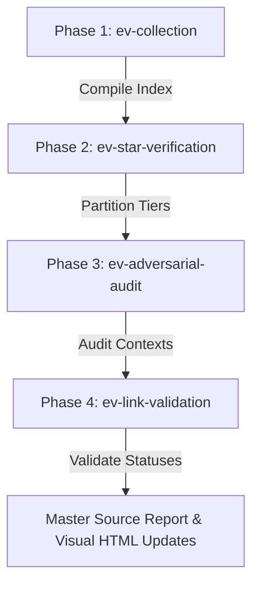

# Evidence Verification Pipeline (evidence-verification-pipeline)

This skill orchestrates the four primary verification phases to compile, audit, and validate the Gaia Registry evidence data lake. It can be invoked as `/evidence-verification-pipeline` or `/ev-pipeline`.

> [!NOTE]
> **Data Lake Lifecycle Stage:** This pipeline operates strictly on the raw evidence **data lake** (`evidence/`) and NOT on the canonical registry itself. It is executed at the **START** of the ingestion process before any evidence gets integrated into the registry.



---

## The Four Phases

### Phase 1: Evidence Collection (`ev-collection`)
Aggregates raw evidence from active collectors (`evidence/collectors/`) and compiles the master database:
```bash
/ev-collection
```

### Phase 2: Live Star Verification (`ev-star-verification`)
Queries the GitHub API for stargazers, validates them against `registry/named/` Markdown files, and generates tiered partitioned raw files under `evidence/`:
```bash
/ev-star-verification
```

### Phase 3: Adversarial Check (`ev-adversarial-audit`)
Deploys parallel adversarial reviewer agents to scan the data lake for evaluative noise, formatting errors (e.g. `tree/` vs `blob/`), and proxy mismatches, appending findings to the daily source report:
```bash
/ev-adversarial-audit
```

### Phase 4: Firecrawl Links Check (`ev-link-validation`)
Performs an active API link scrape verifying uptime and 200 OK statuses across all unique data lake links:
```bash
/ev-link-validation
```

---

## Post-Run Tasks

1. **Verification Records:** Save the validation report inside `evidence/collectors/verification/firecrawl_validation_report_YYYY_MM_DD.md`.
2. **Master Source Report:** Document the audit log, star updates, and compiled adversarial details in `evidence/source_report_YYYY_MM_DD.md`.
3. **Visual Process Update:** Manually verify and update the statistics and pipeline statuses inside `evidence/verification_process.html`.
