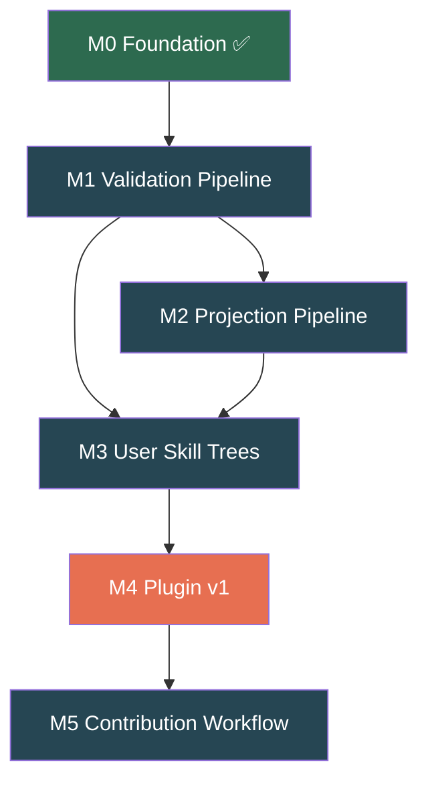

# Gaia — Agent Dispatch Plan

**Purpose:** Break remaining phases (M1–M5) into discrete tasks categorized by compute requirements, dependencies, and parallelizability. Designed for handoff to sub-agents.

> [!IMPORTANT]
> **Phase 0 is complete.** All schemas, seed graph (36 skills), validate.py, CI workflow, CODEOWNERS, README, and CONTRIBUTING are in place and passing validation. Agents should NOT modify these immutable reference files: `PLAN.md`, `SPEC.md`, `DESIGN.md`.

---

## Agent Type Legend

| Agent Type | Symbol | Needs Compute? | Description |
|---|---|---|---|
| **Writer** | ✍️ | No | Produces markdown, YAML, or JSON files. No execution needed. |
| **Coder** | 🔧 | Yes | Writes Python scripts that must be tested against the live graph. |
| **Tester** | 🧪 | Yes | Runs existing scripts, verifies outputs, catches regressions. |
| **Ops** | ⚙️ | No | CI/CD workflows, branch protection config, GitHub settings. |

---

## Dependency Graph



---

## Phase 1 — Validation Pipeline (M1)

> **State:** ~70% done. `validate.py` already implements all 6 checks. Remaining work is test fixtures and CI hardening.

### Task 1.1 — Negative Test Fixtures ✍️
- **Agent:** Writer
- **Compute:** None
- **Depends on:** Nothing
- **Deliverables:**
  - `tests/fixtures/cycle.json` — Graph with an intentional cycle (`A→B→C→A`)
  - `tests/fixtures/missing_ref.json` — Composite skill referencing a nonexistent parent
  - `tests/fixtures/bad_evidence.json` — Level III skill with only Class C evidence
  - `tests/fixtures/orphaned_composite.json` — Composite with only 1 prerequisite
  - `tests/fixtures/legendary_no_approval.json` — Validated legendary with <3 Class A/B sources
- **Instructions:** Each fixture is a minimal `gaia.json` with exactly one defect. Copy structure from `graph/gaia.json` but inject the specific violation. Keep them small (3–5 skills each).
- **Acceptance:** Each file must be valid JSON but fail exactly one validation check.

### Task 1.2 — Test Runner Script 🔧
- **Agent:** Coder
- **Compute:** Yes — must run `validate.py` against each fixture
- **Depends on:** Task 1.1
- **Deliverables:**
  - `tests/test_validate.py` — Runs `validate.py` against each fixture, asserts the correct error is caught and the correct exit code is returned. Also runs against the real `graph/gaia.json` and asserts exit code 0.
- **Instructions:** Use `subprocess.run()` to invoke `validate.py` per fixture. Parse stdout for expected error strings. Framework: plain `unittest` or `pytest` (no exotic deps).
- **Acceptance:** `python -m pytest tests/` passes. Each fixture triggers its intended failure. Clean graph passes.

### Task 1.3 — CI Workflow Update ✍️
- **Agent:** Writer (Ops)
- **Compute:** None
- **Depends on:** Task 1.2
- **Deliverables:**
  - Update `.github/workflows/validate.yml` to also run `pytest tests/` after validation.
- **Instructions:** Add a step after the validation step. Install `pytest` in the pip install step.
- **Acceptance:** Workflow YAML is valid. Test step runs after validate step.

### Task 1.4 — Tag v0.1.0-foundation ⚙️
- **Agent:** Ops (human or agent with git access)
- **Compute:** Git only
- **Depends on:** Tasks 1.1–1.3 all merged
- **Deliverables:** `git tag v0.1.0-foundation && git push --tags`

---

## Phase 2 — Projection Pipeline (M2)

> **State:** 0%. All files are stubs. This phase is highly parallelizable — the two generators are independent.

### Task 2.1 — generateProjections.py 🔧
- **Agent:** Coder
- **Compute:** Yes — must run against `graph/gaia.json` and verify output files
- **Depends on:** M0 (gaia.json exists)
- **Deliverables:**
  - `scripts/generateProjections.py` — Reads `graph/gaia.json`, generates:
    - `skills/atomic/{id}.md` for each atomic skill
    - `skills/composite/{id}.md` for each composite skill
    - `skills/legendary/{id}.md` for each legendary skill
    - `registry.md` — flat sorted index (table: name, type, level, rarity, status)
    - `combinations.md` — matrix of fusion recipes (prerequisites, conditions, level floors)
  - Every generated file includes a provenance footer: `*Generated from gaia.json v{version} on {timestamp}. Do not edit directly.*`
- **Instructions:**
  - Skill page structure must match `DESIGN.md` §5 exactly (see lines 237–275).
  - Output must be **deterministic** — same input always produces byte-identical output. Use sorted keys, fixed timestamps from graph metadata.
  - Use `os.path.join` for paths. Write to repo root.
- **Acceptance:** Run twice — output must be identical. All 36 skills produce `.md` files. `registry.md` has 36 rows. `combinations.md` lists all 8 composite + 3 legendary recipes.

### Task 2.2 — exportGexf.py 🔧
- **Agent:** Coder
- **Compute:** Yes — must generate and validate GEXF XML
- **Depends on:** M0 (gaia.json exists)
- **Parallel with:** Task 2.1
- **Deliverables:**
  - `scripts/exportGexf.py` — Reads `graph/gaia.json`, outputs `graph/gaia.gexf` in GEXF 1.2 format.
  - Custom attribute namespaces for: `level`, `rarity`, `status`, `type`.
- **Instructions:** Use Python `xml.etree.ElementTree` (stdlib only, no deps). Follow GEXF 1.2 spec. Include all skills as nodes and all edges.
- **Acceptance:** Output is well-formed XML. Openable in Gephi (or passes XML schema validation).

### Task 2.3 — CI Drift Detection ✍️
- **Agent:** Writer (Ops)
- **Compute:** None
- **Depends on:** Tasks 2.1, 2.2
- **Deliverables:**
  - `.github/workflows/generate.yml` — New workflow that:
    1. Runs `generateProjections.py`
    2. Runs `exportGexf.py`
    3. Runs `git diff --exit-code` to detect drift between committed and freshly generated files
    4. Fails if any difference is found
- **Instructions:** Triggers on PRs touching `graph/` or `schema/`. Runs after validation passes (`needs: validate`).
- **Acceptance:** YAML is valid. A hand-edited `skills/atomic/tokenize.md` would cause this workflow to fail.

### Task 2.4 — First Static Snapshot ✍️
- **Agent:** Writer
- **Compute:** None (just a file copy)
- **Depends on:** Task 2.1
- **Deliverables:** `graph/render/v0.1.0.json` — A D3/Cytoscape-compatible export matching `DESIGN.md` §10.1 structure (nodes array + edges array + meta object).
- **Instructions:** Can be generated as part of `generateProjections.py` or as a standalone step. Structure:
  ```json
  { "nodes": [...], "edges": [...], "meta": { "version": "0.1.0", "generatedAt": "...", "totalNodes": N, "totalEdges": M } }
  ```

---

## Phase 3 — User Skill Trees (M3)

> **State:** ~20%. Seed user tree and CODEOWNERS exist. Scripts are stubs.

### Task 3.1 — detectCombinations.py 🔧
- **Agent:** Coder
- **Compute:** Yes — must test against seed user tree + graph
- **Depends on:** M0 (gaia.json, user tree exist)
- **Deliverables:**
  - `scripts/detectCombinations.py` — Shared module implementing the algorithm from `DESIGN.md` §8.1:
    ```
    For each composite/legendary skill S in gaiaGraph:
      If S is NOT in ownedSkills:
        If all prerequisites of S are in (detectedSkills ∪ ownedSkills):
          Add S to pendingCombinations
    ```
  - Must be importable as a module (used by plugin in Phase 4) AND runnable as CLI.
  - CLI: `python scripts/detectCombinations.py --graph graph/gaia.json --detected skillA,skillB --owned users/mbtiongson1/skill-tree.json`
- **Instructions:** Handle edge cases from `DESIGN.md` §8.2 (already-owned at lower level = level-up candidate; legendary = flagged for review).
- **Acceptance:** Given `detectedSkills = {codeGeneration, executeBash, errorInterpretation}` and the seed user tree, returns `autonomousDebug` as a candidate.

### Task 3.2 — computeRarity.py 🔧
- **Agent:** Coder
- **Compute:** Yes — reads all user trees in `users/`
- **Depends on:** M0
- **Parallel with:** Task 3.1
- **Deliverables:**
  - `scripts/computeRarity.py` — Reads all `users/*/skill-tree.json`, computes prevalence % per skill, outputs a rarity override table.
  - Thresholds from `SPEC.md` §7.3: >40% = common, 20–40% = uncommon, 5–20% = rare, 1–5% = epic, <1% = legendary.
- **Instructions:** Output as JSON to stdout. Optional `--apply` flag to write rarity updates back into `gaia.json`.
- **Acceptance:** With 1 seed user tree, all 7 unlocked skills show 100% prevalence → common.

### Task 3.3 — User Tree Projection Extension ✍️
- **Agent:** Writer (or extend Task 2.1)
- **Compute:** None if template only; Yes if generating
- **Depends on:** Task 2.1
- **Deliverables:** Extend `generateProjections.py` to also generate `users/{username}/skill-tree.md` for each user tree, matching `DESIGN.md` §6 structure (lines 281–307).
- **Acceptance:** `users/mbtiongson1/skill-tree.md` is generated with correct stats, unlocked skills table, and pending combinations block.

### Task 3.4 — Second Seed User Tree ✍️
- **Agent:** Writer
- **Compute:** None
- **Depends on:** Nothing
- **Parallel with:** Everything
- **Deliverables:** `users/gaiabot/skill-tree.json` — A second example user tree (3–5 atomic skills, no composites yet, 1 pending combination). Must validate against `schema/skillTree.schema.json`.
- **Acceptance:** Valid JSON matching the schema. Different skill set from mbtiongson1.

---

## Phase 4 — Plugin v1 (M4)

> **State:** 0%. All stubs. This is the heaviest phase — 7 Python modules + GitHub Action. **High compute requirement.**

### Task 4.1 — scanner.py 🔧
- **Agent:** Coder
- **Compute:** Yes
- **Depends on:** M0
- **Deliverables:** `plugin/cli/scanner.py` — Reads `.gaia/config.json`, scans declared `scanPaths` for skill ID references (in `.md` files, MCP tool declarations, agent configs). Returns a set of resolved Gaia skill IDs.
- **Acceptance:** Scanning this repo's `skills/` dir (after projections exist) returns known skill IDs.

### Task 4.2 — resolver.py 🔧
- **Agent:** Coder
- **Compute:** Yes
- **Depends on:** Task 4.1
- **Deliverables:** `plugin/cli/resolver.py` — Fetches or reads `gaia.json` from the configured `gaiaRegistryRef`. Resolves raw detected tokens to canonical skill IDs.

### Task 4.3 — combinator.py 🔧
- **Agent:** Coder
- **Compute:** Yes
- **Depends on:** Task 3.1 (imports `detectCombinations`)
- **Deliverables:** `plugin/cli/combinator.py` — Wraps `scripts/detectCombinations.py`. Returns ranked combination candidates (prioritize higher rarity unlocks).

### Task 4.4 — treeManager.py 🔧
- **Agent:** Coder
- **Compute:** Yes
- **Depends on:** M0
- **Deliverables:** `plugin/cli/treeManager.py` — Load/save/diff/status/tree commands for user skill trees.

### Task 4.5 — prWriter.py 🔧
- **Agent:** Coder
- **Compute:** Yes (needs GitHub API mocking)
- **Depends on:** Task 4.4
- **Deliverables:** `plugin/cli/prWriter.py` — Opens a PR against the Gaia registry with updated `skill-tree.json`. PR body includes detected skills, combination confirmed, source repo, timestamp.

### Task 4.6 — main.py + CLI 🔧
- **Agent:** Coder
- **Compute:** Yes
- **Depends on:** Tasks 4.1–4.5
- **Deliverables:** `plugin/cli/main.py` — CLI entrypoint with commands: `init`, `scan`, `status`, `tree`, `load`, `fuse`, `diff`. Uses `argparse`.

### Task 4.7 — GitHub Action ✍️
- **Agent:** Writer (Ops)
- **Compute:** None
- **Depends on:** Task 4.6
- **Deliverables:**
  - `plugin/github-action/action.yml` — Composite action that runs `gaia scan` on push
  - `plugin/github-action/entrypoint.sh` — Shell entrypoint
  - `plugin/README.md` — Installation instructions, command reference, config options

---

## Phase 5 — Contribution Workflow (M5)

> **State:** 0%. Entirely non-compute. Pure writing. **All tasks parallelizable.**

### Task 5.1 — PR Templates ✍️
- **Agent:** Writer
- **Compute:** None
- **Depends on:** Nothing
- **Parallel with:** Everything in Phase 5
- **Deliverables:**
  - `.github/PULL_REQUEST_TEMPLATE/new_atomic_skill.md`
  - `.github/PULL_REQUEST_TEMPLATE/new_composite_skill.md`
  - `.github/PULL_REQUEST_TEMPLATE/new_fusion.md`
  - `.github/PULL_REQUEST_TEMPLATE/reclassification.md`
  - `.github/PULL_REQUEST_TEMPLATE/new_user_tree.md`
- **Instructions:** Each template includes the reviewer checklist from `PLAN.md` §9 (correctness, compositional validity, evidence quality, classification quality, graph integrity). Use GitHub markdown checkbox syntax.

### Task 5.2 — Example Submissions ✍️
- **Agent:** Writer
- **Compute:** None
- **Parallel with:** Task 5.1
- **Deliverables:**
  - `docs/examples/example_atomic_skill.md`
  - `docs/examples/example_composite_skill.md`
  - `docs/examples/example_reclassification.md`
- **Instructions:** Each example is a filled-out PR template showing what a real submission looks like. Use skills from the seed graph as references.

### Task 5.3 — Governance Doc ✍️
- **Agent:** Writer
- **Compute:** None
- **Parallel with:** Tasks 5.1, 5.2
- **Deliverables:** `docs/GOVERNANCE.md` covering maintainer roles, dispute resolution, quarterly re-audit schedule, release cadence (from `PLAN.md` §9).

### Task 5.4 — CONTRIBUTING.md Update ✍️
- **Agent:** Writer
- **Compute:** None
- **Depends on:** Task 5.1 (to reference template filenames)
- **Deliverables:** Append "why rejected" taxonomy to existing `CONTRIBUTING.md`. Link to the new PR templates.
- **Note:** `CONTRIBUTING.md` already has the rejection taxonomy — verify and supplement if needed.

---

## Parallelization Map

> Which tasks can run simultaneously with zero conflicts?

```
TIME ──────────────────────────────────────────────────────────►

Batch A (no dependencies, start immediately):
  ├── Task 1.1  ✍️  Negative test fixtures
  ├── Task 3.4  ✍️  Second seed user tree
  ├── Task 5.1  ✍️  PR templates
  ├── Task 5.2  ✍️  Example submissions
  └── Task 5.3  ✍️  Governance doc

Batch B (depends on M0 only, start immediately):
  ├── Task 2.1  🔧  generateProjections.py
  ├── Task 2.2  🔧  exportGexf.py
  ├── Task 3.1  🔧  detectCombinations.py
  ├── Task 3.2  🔧  computeRarity.py
  └── Task 4.1  🔧  scanner.py

Batch C (depends on Batch A/B):
  ├── Task 1.2  🧪  Test runner (needs 1.1)
  ├── Task 2.3  ✍️  CI drift detection (needs 2.1, 2.2)
  ├── Task 2.4  ✍️  Static snapshot (needs 2.1)
  ├── Task 3.3  🔧  User tree projection (needs 2.1)
  ├── Task 4.2  🔧  resolver.py (needs 4.1)
  └── Task 4.3  🔧  combinator.py (needs 3.1)

Batch D (depends on Batch C):
  ├── Task 1.3  ✍️  CI workflow update (needs 1.2)
  ├── Task 4.4  🔧  treeManager.py
  └── Task 4.5  🔧  prWriter.py (needs 4.4)

Batch E (final assembly):
  ├── Task 4.6  🔧  main.py CLI (needs 4.1–4.5)
  ├── Task 4.7  ✍️  GitHub Action + plugin README
  ├── Task 5.4  ✍️  CONTRIBUTING update
  └── Task 1.4  ⚙️  Tag v0.1.0-foundation
```

---

## Summary by Agent Type

| Agent Type | Tasks | Total |
|---|---|---|
| ✍️ Writer (no compute) | 1.1, 1.3, 2.3, 2.4, 3.3, 3.4, 4.7, 5.1, 5.2, 5.3, 5.4 | **11** |
| 🔧 Coder (compute) | 1.2, 2.1, 2.2, 3.1, 3.2, 4.1, 4.2, 4.3, 4.4, 4.5, 4.6 | **11** |
| ⚙️ Ops (git/CI only) | 1.4 | **1** |

**Writer agents can immediately start 7 tasks (Batch A + some Batch B) with zero blockers.**

---

## Critical Path

The longest dependency chain determines minimum wall-clock time:

```
M0 ✅ → Task 2.1 → Task 3.3 → Task 4.1 → Task 4.2 → Task 4.4 → Task 4.5 → Task 4.6
```

Everything outside this chain is parallelizable. The **entire Phase 5** (4 tasks) runs independently and can be completed by Writer agents while Coder agents work through Phase 2–4.
